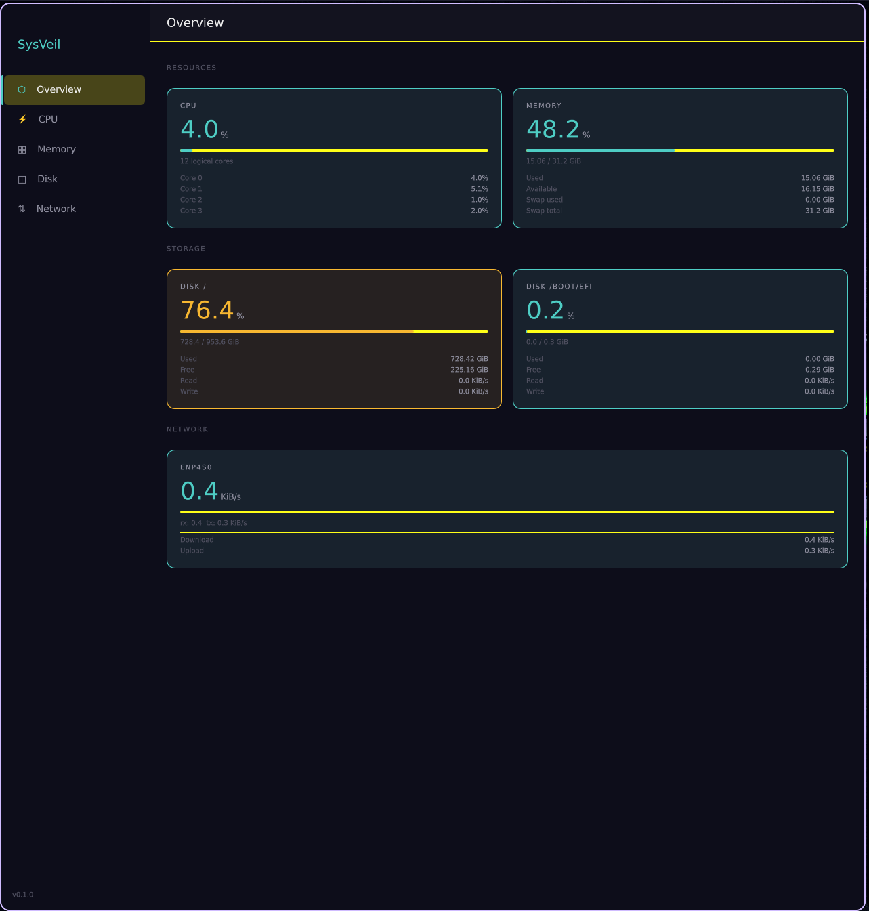
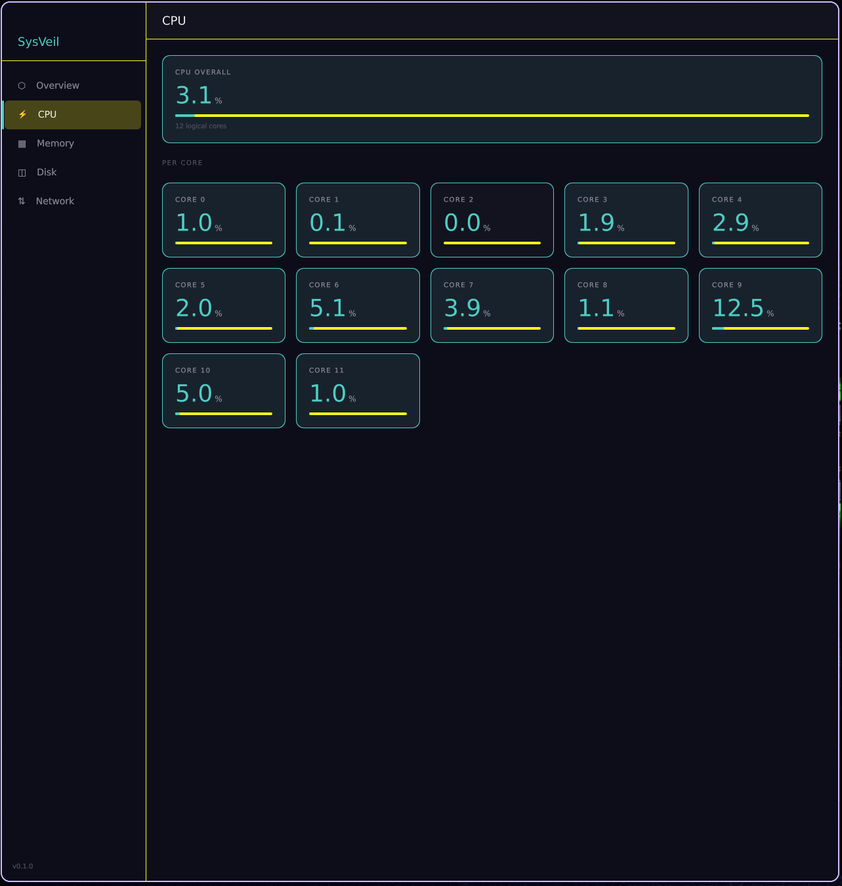

# SysVeil

> Real-time cross-platform system resource monitor built with C++ and Qt Quick.

[](https://github.com/Hucum74/sysveil/actions/workflows/build.yml)

## Screenshots



## Platform support

| Platform | Status |
|----------|--------|
| Linux    | ✅ Tested |
| Windows  | ✅ Tested |
| macOS    | ✅ Tested |

## Build instructions

### Prerequisites
- CMake 3.21+
- Qt 6.2+ with modules: `qtcharts`, `qtdeclarative`

### Linux
```bash
cmake -B build -DCMAKE_BUILD_TYPE=Release -DCMAKE_PREFIX_PATH=/usr
cmake --build build --parallel
./build/src/sysveil
```

### Windows
```bash
cmake -B build -DCMAKE_PREFIX_PATH=C:\Qt\6.7.0\msvc2019_64
cmake --build build --config Release --parallel
```

### macOS
```bash
cmake -B build -DCMAKE_BUILD_TYPE=Release
cmake --build build --parallel
open build/src/sysveil.app
```

## Architecture
```
Platform APIs (OS)
      │
      ▼
CpuProvider / MemoryProvider / DiskProvider / NetworkProvider
      │  (worker QThread, polls every 1s)
      ▼
SystemMonitor  (aggregator)
      │  (Qt signals)
      ▼
MonitorBridge  (QObject registered to QML engine)
      │  (Q_PROPERTY + NOTIFY)
      ▼
QML UI  (binds directly, animates on change)
```

## Roadmap

- [x] Phase 1 — CMake scaffold, CI, Qt Quick skeleton
- [x] Phase 2 — CPU, memory, disk, network data providers
- [x] Phase 3 — QML bridge and data models
- [x] Phase 4 — Core UI with live charts (live charts stubbed)
- [ ] Phase 5 — Process table
- [ ] Phase 6 — Packaging (NSIS / DMG / AppImage)